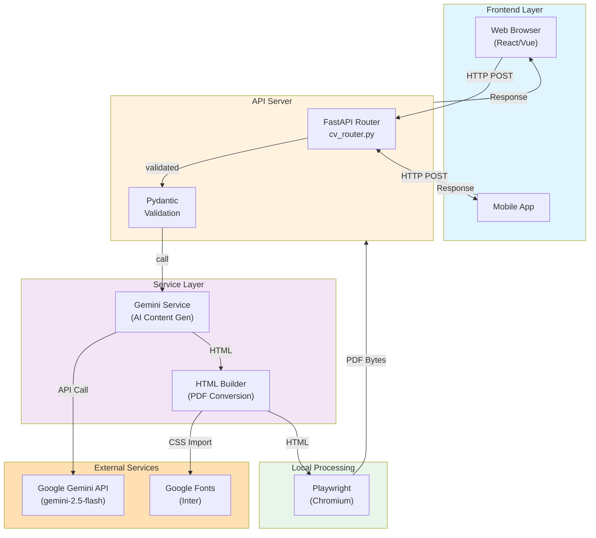
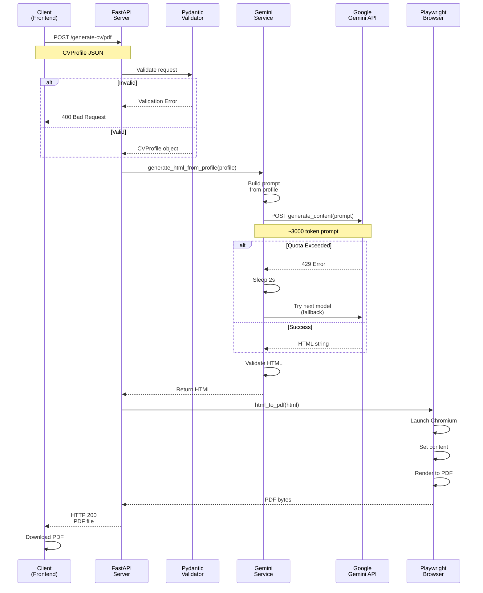
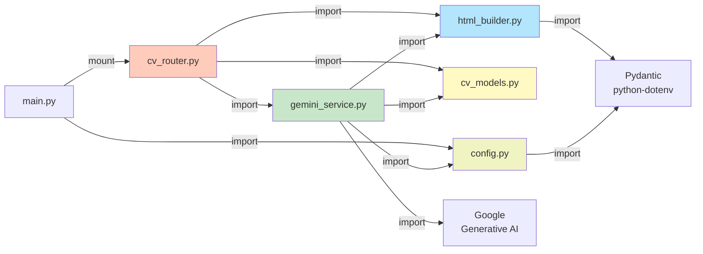
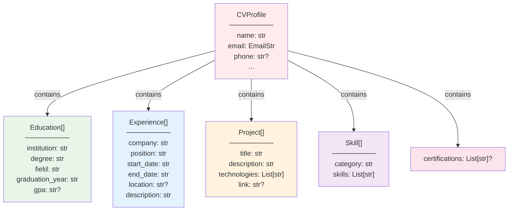
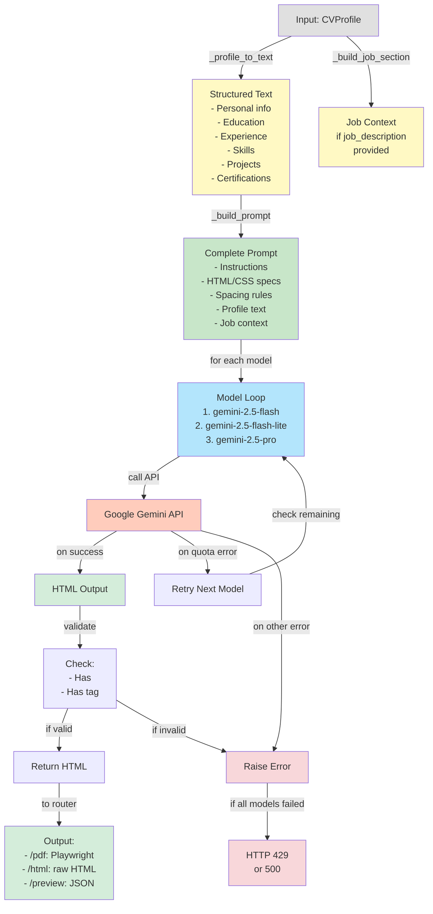

# CV Generator - Complete Technical Documentation

**Version:** 1.0.0  
**Last Updated:** April 25, 2026  
**Project Status:** ✅ Production Ready

---

## Table of Contents

1. [Project Introduction](#1-project-introduction)
2. [Technologies Used](#2-technologies-used)
3. [System Architecture](#3-system-architecture)
4. [How the Project Works Internally](#4-how-the-project-works-internally)
5. [Backend Documentation](#5-backend-documentation)
6. [Full API Documentation](#6-full-api-documentation)
7. [Database & Data Models](#7-database--data-models)
8. [Frontend Integration](#8-frontend-integration)
9. [Installation & Setup](#9-installation--setup)
10. [Development Workflow](#10-development-workflow)
11. [Contributing Guide](#11-contributing-guide)
12. [Improvements & Recommendations](#12-improvements--recommendations)
13. [Architecture Diagrams](#13-architecture-diagrams)

---

## 1. Project Introduction

### Project Name & Purpose

**CV Generator API** is an intelligent, AI-powered REST API service that transforms user-provided CV information into professionally formatted, ATS-optimized CVs in multiple formats (HTML, PDF, JSON preview).

The system leverages Google's Generative AI (Gemini 2.5) to intelligently expand, enhance, and professionally write CV content based on raw user input, with optional job description matching to tailor CVs to specific positions.

### Problem Solved

Traditional CV creation suffers from several challenges:

1. **Time Consuming**: Users spend hours writing and formatting CVs
2. **Low Quality**: Without professional writing skills, CVs read poorly
3. **ATS Rejection**: Many CVs get rejected by Applicant Tracking Systems due to formatting
4. **Job Mismatch**: CVs aren't tailored to specific job postings, reducing match scores
5. **Technical Barriers**: PDF/formatting knowledge required to create professional layouts

**Solution**: CV Generator automates and improves all these aspects using AI.

### Main Features

✅ **AI-Powered Content Generation**: Google Gemini intelligently expands bullet points into full achievements  
✅ **Multi-Format Output**: HTML, PDF, and JSON preview formats  
✅ **Job Description Matching**: Optional target job input to tailor CV content  
✅ **ATS Optimization**: Semantic HTML, keyword optimization, no emoji/symbols  
✅ **Single-Page PDF**: Guarantees all CVs fit exactly on one A4 page  
✅ **Automatic Model Fallback**: Uses 3 Gemini models with automatic fallback on quota  
✅ **Professional Design**: Modern color palette, typography, and spacing optimized for readability  
✅ **Fast Generation**: 10-15 seconds average from submission to download  

### High-Level Overview

```
User provides CV data (name, email, education, experience, skills, projects)
                    ↓
        FastAPI validates input with Pydantic
                    ↓
        Gemini Service receives validated profile
                    ↓
        Converts CV data → Structured prompt (with job description if provided)
                    ↓
        Sends to Google Gemini 2.5-flash model
                    ↓
        Gemini returns professional HTML CV (ATS-optimized)
                    ↓
        Frontend can request:
        - PDF format (Playwright converts HTML → PDF)
        - HTML format (returns raw HTML)
        - Preview format (returns JSON with HTML)
                    ↓
        Client downloads/views generated CV
```

---

## 2. Technologies Used

### Backend Technologies

#### **FastAPI** - Web Framework
- **Purpose**: REST API server framework, request routing, validation
- **Why Chosen**: 
  - Automatic OpenAPI/Swagger documentation
  - Built-in data validation via Pydantic
  - Async/await support for non-blocking I/O
  - Type hints for developer experience
- **Version**: Latest
- **Key Components**:
  - `main.py`: FastAPI app initialization, router mounting
  - `routers/cv_router.py`: All CV generation endpoints
  - Automatic `/docs` and `/redoc` API documentation

#### **Uvicorn** - ASGI Server
- **Purpose**: Production-ready async Python application server
- **Why Chosen**: Industry standard for FastAPI, handles multiple concurrent requests
- **Version**: Latest
- **Configuration**: Running on `0.0.0.0:8000` with auto-reload in development

#### **Pydantic v2** - Data Validation
- **Purpose**: Runtime type checking, data validation, schema definition
- **Why Chosen**: Enforces type safety, provides helpful validation error messages
- **Key Models**:
  - `CVProfile`: Main data container
  - `Education`, `Experience`, `Project`, `Skill`: Nested models
- **Validation Features**:
  - Email format validation (EmailStr)
  - Type checking for all fields
  - Optional vs required field enforcement
  - Automatic error message generation

#### **Google Generative AI (Gemini)** - AI Model
- **Purpose**: Generate professional CV content from raw input
- **Why Chosen**: State-of-the-art LLM, powerful writing capability, free tier available
- **Models Used** (with fallback):
  1. `gemini-2.5-flash` (primary)
  2. `gemini-2.5-flash-lite` (fallback 1)
  3. `gemini-2.5-pro` (fallback 2)
- **Configuration**:
  - Max output tokens: 8192
  - Temperature: 0.7 (balanced between deterministic and creative)
  - API key loaded from environment
- **Integration**: `services/gemini_service.py`

#### **Playwright** - Browser Automation
- **Purpose**: Convert HTML to PDF with perfect rendering
- **Why Chosen**: 
  - Handles complex CSS (Grid, Flexbox, Google Fonts)
  - Exactly reproduces browser rendering
  - Reliable page size handling
- **Browser**: Chromium
- **Configuration**:
  - Headless mode
  - Sandbox disabled for container compatibility
  - A4 page format with 1.5cm margins
  - Print background enabled

#### **Python-dotenv** - Environment Management
- **Purpose**: Load environment variables from `.env` file
- **Why Chosen**: Simple, standard practice for credentials
- **Used For**: `GOOGLE_API_KEY`

### Frontend Technologies (Used by Clients)

Frontend implementations should use:
- Modern JavaScript (ES6+) or TypeScript
- HTTP client (Fetch API, Axios, or similar)
- JSON serialization
- File download capability
- Optional: iframe for HTML preview

**Supported Frameworks**: React, Vue, Angular, Svelte, or vanilla JS

### APIs & External Services

#### **Google Generative AI API**
- **Endpoint**: `https://generativelanguage.googleapis.com`
- **Authentication**: API key (Google Cloud)
- **Rate Limits**: 
  - Free tier: 60 requests per minute
  - Quota reset: Every 24 hours
- **Fallback Handling**: Automatic model switching if quota exceeded

#### **Google Fonts**
- **Usage**: Inter font family (300, 400, 600, 700 weights)
- **Integration**: CSS `@import` in generated HTML
- **Fallback**: System fonts (Helvetica Neue, Arial, sans-serif)

### DevOps & Deployment

#### **Git/GitHub**
- Version control, source repository

#### **Docker** (Optional but Recommended)
- Container for consistent deployment
- Includes Chromium for Playwright

#### **Environment Variables**
- `GOOGLE_API_KEY`: Required for Gemini API access

### Development Tools

#### **Logging**
- Python built-in `logging` module
- Configured in `main.py`
- Log format: `timestamp | level | logger | message`

---

## 3. System Architecture

### Overall Architecture Type

**Client-Server REST API Architecture**

```
┌─────────────────────┐
│   Frontend Client   │  (React, Vue, or any HTTP client)
│  (Browser/App)      │
└──────────┬──────────┘
           │
           │ HTTP/REST
           │ (JSON)
           ↓
┌─────────────────────────────────────┐
│     FastAPI Server (Uvicorn)        │
│     (localhost:8000)                │
│                                     │
│  ┌───────────────────────────────┐ │
│  │  API Router (cv_router.py)    │ │
│  │  - POST /generate-cv/pdf      │ │
│  │  - POST /generate-cv/html     │ │
│  │  - POST /generate-cv/preview  │ │
│  └───────────────────────────────┘ │
│           ↓                         │
│  ┌───────────────────────────────┐ │
│  │  Pydantic Models (validation) │ │
│  └───────────────────────────────┘ │
│           ↓                         │
│  ┌───────────────────────────────┐ │
│  │  Gemini Service               │ │
│  │  - Prompt building            │ │
│  │  - Model selection/fallback   │ │
│  │  - HTML generation            │ │
│  └───────────────────────────────┘ │
│           ↓                         │
│  ┌───────────────────────────────┐ │
│  │  HTML Builder Service         │ │
│  │  - PDF conversion (Playwright)│ │
│  │  - HTML cleaning              │ │
│  └───────────────────────────────┘ │
└──────────┬───────────────────────────┘
           │
           │ HTTP/Streaming
           │
           ↓
      Google Generative AI API
      (Gemini Models)
```

### Folder Structure

```
cv_generator/
├── main.py
│   └── Entry point, FastAPI app setup, router mounting
│
├── config.py
│   └── Settings, environment variable loading
│
├── requirements.txt
│   └── Python dependencies
│
├── .env
│   └── GOOGLE_API_KEY (not in git)
│
├── models/
│   ├── __init__.py
│   └── cv_models.py
│       ├── CVProfile
│       ├── Education
│       ├── Experience
│       ├── Project
│       └── Skill
│
├── routers/
│   ├── __init__.py
│   └── cv_router.py
│       ├── /generate-cv/pdf (POST)
│       ├── /generate-cv/html (POST)
│       └── /generate-cv/preview (POST)
│
└── services/
    ├── __init__.py
    ├── gemini_service.py
    │   ├── generate_html_from_profile()
    │   ├── _build_prompt()
    │   ├── _profile_to_text()
    │   ├── _build_job_section()
    │   └── Model fallback logic
    │
    ├── html_builder.py
    │   ├── html_to_pdf()
    │   └── strip_html_fences()
    │
    └── latex_builder.py
        ├── escape_latex()
        └── strip_markdown_fences()
        (Currently unused - for future LaTeX output)
```

### Modules & Responsibilities

#### **main.py** - Application Entry Point
- Initializes FastAPI app
- Sets up logging
- Mounts routers
- Exposes root endpoint (`GET /`)
- Generates OpenAPI documentation

#### **config.py** - Configuration Management
- Loads environment variables via Pydantic Settings
- Validates required settings at startup
- Provides `settings` object to services

#### **models/cv_models.py** - Data Models
- Defines all Pydantic models for validation
- `CVProfile`: Master model containing all CV data
- Nested models: Education, Experience, Project, Skill
- All models use type hints and validation rules

#### **routers/cv_router.py** - API Endpoints
- Implements 3 main endpoints:
  1. `POST /generate-cv/pdf` → PDF file download
  2. `POST /generate-cv/html` → Raw HTML response
  3. `POST /generate-cv/preview` → JSON with HTML
- Calls Gemini Service to generate HTML
- For PDF: calls HTML Builder to convert
- Error handling and logging

#### **services/gemini_service.py** - Core Business Logic
- **Main function**: `generate_html_from_profile(CVProfile) → str`
- Converts CV data to structured prompt text
- Handles job description context if provided
- Implements model fallback logic (3 models)
- Validates output HTML
- Handles API errors and quota limits

#### **services/html_builder.py** - PDF Conversion
- `html_to_pdf(html_content: str) → bytes`
- Uses Playwright to render HTML
- Configures A4 page size, margins
- Enables print background for colors
- Handles browser errors

#### **services/latex_builder.py** - Utility (Currently Unused)
- LaTeX escaping functions
- Reserved for future LaTeX output format
- Can be removed or updated when LaTeX support added

### Data Flow Between Components

```
1. Frontend sends POST request with CVProfile JSON
                    ↓
2. FastAPI Router receives request (cv_router.py)
                    ↓
3. Pydantic validates request body
   - If invalid: returns 400 error with validation details
   - If valid: proceeds with CVProfile object
                    ↓
4. Router calls generate_html_from_profile(profile)
   (from services/gemini_service.py)
                    ↓
5. Gemini Service:
   a. Converts profile → structured text (_profile_to_text)
   b. Adds job context if provided (_build_job_section)
   c. Builds detailed prompt (_build_prompt)
   d. For each model in fallback list:
      - Calls Gemini API
      - If success: validates HTML, returns it
      - If quota error: sleeps 2s, tries next model
      - If other error: logs and raises HTTPException
                    ↓
6a. For /generate-cv/pdf endpoint:
    - HTML → html_to_pdf(html) via Playwright
    - Returns PDF bytes in StreamingResponse
                    ↓
6b. For /generate-cv/html endpoint:
    - Returns HTML string in Response
                    ↓
6c. For /generate-cv/preview endpoint:
    - Wraps HTML in JSON: {status, name, html}
                    ↓
7. Frontend receives response
   - PDF: downloads file
   - HTML: displays in iframe or processes further
   - Preview: stores JSON or displays
```

### Request Lifecycle

```
Incoming HTTP Request (POST /generate-cv/pdf)
           ↓
FastAPI routing layer
           ↓
Request body validation (Pydantic)
           ↓
Router function (async/await)
           ↓
Call Gemini Service (blocking call in thread)
           ↓
Build prompt, call Gemini API
           ↓
Handle response or error
           ↓
Call HTML Builder (convert HTML to PDF)
           ↓
Return PDF bytes as StreamingResponse
           ↓
HTTP 200 with PDF file OR HTTP 500 with error
           ↓
Frontend receives file
```

### Architectural Patterns Used

#### **1. MVC-like Pattern**
- **Models**: Pydantic models define data structure
- **Views**: API endpoints (routers)
- **Controllers**: Service functions (business logic)

#### **2. Service Layer Pattern**
- Business logic separated into services
- `gemini_service.py` handles AI generation
- `html_builder.py` handles PDF conversion
- Routers orchestrate services

#### **3. Dependency Injection (Implicit)**
- Services receive data through function parameters
- Configuration via `config.py` module

#### **4. Error Handling**
- Validation errors caught by Pydantic
- API errors caught and logged
- HTTPException used for REST error responses

#### **5. Async/Await**
- Endpoints are async
- PDF generation runs in thread pool (non-blocking)
- FastAPI handles concurrency

---

## 4. How the Project Works Internally

### Application Flow

#### **Step 1: User Submits CV Data**

Frontend sends HTTP POST with JSON:
```json
{
  "name": "John Doe",
  "email": "john@example.com",
  "phone": "+1-555-1234",
  "education": [...],
  "experience": [...],
  "skills": [...],
  "projects": [...],
  "job_description": "Senior Python Developer at TechCorp..."
}
```

#### **Step 2: FastAPI Receives & Validates Request**

```python
@router.post("/generate-cv/pdf")
async def generate_cv_pdf(profile: CVProfile):  # Pydantic validates here
    # At this point, profile is guaranteed to be valid
```

Pydantic checks:
- All required fields present
- Email format valid
- Data types correct
- Array fields properly structured

#### **Step 3: Gemini Service Transforms CV**

**3a. Profile to Text Conversion**

`_profile_to_text(profile)` transforms structured data into readable text:

```
=== PERSONAL INFORMATION ===
Full Name  : John Doe
Email      : john@example.com
Phone      : +1-555-1234
...

=== PROFESSIONAL SUMMARY ===
Experienced Python developer with 5+ years...

=== EDUCATION ===
[Degree 1]
  Institution : MIT
  Degree      : BS Computer Science
  ...

=== PROFESSIONAL EXPERIENCE ===
[Role 1]
  Company     : TechCorp
  Position    : Senior Developer
  Description : Led microservices architecture redesign...
  
[Role 2]
  ...
```

**3b. Job Context Addition** (if job_description provided)

If `profile.job_description` is set, creates a section:

```
=======================================================
TARGET JOB — READ THIS FIRST BEFORE WRITING ANYTHING:
=======================================================
The candidate is applying for the following position.
You MUST tailor every section of the CV to match this job.

JOB DESCRIPTION:
[Full job posting text]

HOW TO ADAPT THE CV TO THIS JOB:
[Detailed instructions for Gemini]
```

**3c. Prompt Building**

Combines text + job context + detailed HTML/CSS requirements into a mega-prompt (~3000 tokens).

Prompt tells Gemini:
- You're a world-class CV writer
- Generate rich, expanded content (not just copy input)
- Specific HTML/CSS structure required
- Must fit exactly on 1 A4 page
- No emoji or unicode symbols
- Use semantic HTML for ATS compatibility
- If job description: tailor everything to match it
- [Detailed styling instructions]
- [Section-by-section generation rules]

**3d. Call Gemini API**

```python
model = genai.GenerativeModel('gemini-2.5-flash')
response = model.generate_content(
    prompt,
    generation_config=GenerationConfig(
        max_output_tokens=8192,
        temperature=0.7
    )
)
html_output = response.text
```

**3e. Model Fallback Logic**

If `gemini-2.5-flash` returns quota error (status 429):
1. Sleep 2 seconds
2. Try `gemini-2.5-flash-lite`
3. If fails: try `gemini-2.5-pro`
4. If all fail: return HTTP 429 to client

This ensures CV generation completes unless all quotas exhausted.

**3f. Output Validation**

```python
cleaned_output = strip_html_fences(html_output)
if "<!DOCTYPE html>" not in cleaned_output and "<html" not in cleaned_output:
    raise ValueError("Invalid HTML")
```

Checks that Gemini returned valid HTML (not markdown, not error text).

#### **Step 4: HTML Output**

Gemini returns complete self-contained HTML:

```html
<!DOCTYPE html>
<html>
  <head>
    <style>
      @import url('https://fonts.googleapis.com/css2?family=Inter:wght@300;400;600;700&display=swap');
      @page { size: A4; margin: 1cm; }
      body { font-family: 'Inter', sans-serif; ... }
      /* All CSS inline, optimized for PDF */
    </style>
  </head>
  <body>
    <header><!-- Professional header --></header>
    <section><!-- About section --></section>
    <section><!-- Education --></section>
    <section><!-- Experience --></section>
    <section><!-- Skills --></section>
    <section><!-- Projects --></section>
    <!-- Certifications only if provided -->
  </body>
</html>
```

#### **Step 5: Format-Specific Processing**

**5a. For `/generate-cv/pdf`:**

```python
pdf_bytes = await asyncio.to_thread(html_to_pdf, html_content)
```

Playwright renders HTML in Chromium:
- Loads Google Fonts
- Applies CSS (Grid, Flexbox, colors, spacing)
- Renders to A4 PDF
- Returns binary PDF data

**5b. For `/generate-cv/html`:**

Returns raw HTML string with `Content-Type: text/html`

**5c. For `/generate-cv/preview`:**

Wraps HTML in JSON:
```json
{
  "status": "success",
  "name": "John Doe",
  "html": "<!DOCTYPE html>..."
}
```

#### **Step 6: Response to Frontend**

```
HTTP 200
Content-Type: application/pdf
Content-Disposition: attachment; filename="John_Doe_CV.pdf"
[PDF binary data]
```

Browser automatically downloads PDF with correct name.

### Authentication Flow

**Current Status**: No authentication implemented.

**For future**: If authentication needed:
1. Add JWT token validation middleware
2. Extract user_id from token
3. Store CVs in database linked to user_id
4. Validate ownership before generation

### Business Logic Details

#### **Single-Page PDF Guarantee**

Gemini is instructed to ensure CV fits on 1 A4 page. Instructions include:

```
CRITICAL: The entire CV MUST fit in exactly ONE A4 page — non-negotiable
Achieve single page by REMOVING SPACE between sections, not by shortening content
```

CSS uses minimal spacing:
- `section { margin-bottom: 0.3em; }`
- `h3 { margin: 0; }`
- `p { margin: 0.1em 0; }`
- `page-break-inside: avoid` on all sections

#### **ATS Optimization**

Generated HTML is ATS-friendly:
- Semantic tags: `<header>`, `<section>`, `<h1-3>`, `<ul>`, `<p>`
- No fancy styling that breaks parsers
- Keywords from job description naturally integrated
- No emoji or unicode symbols that confuse ATS

#### **Job Description Matching**

When job_description provided, Gemini:
1. Analyzes job requirements
2. Extracts key skills/technologies
3. Highlights matching experience in CV
4. Reorders accomplishments by relevance
5. Uses job terminology in descriptions
6. Matches professional headline to job title

Improves job application success rate.

#### **Quality Control**

Multiple checks ensure quality:
1. **Prompt validation**: Non-empty profile data
2. **API response validation**: HTML structure check
3. **Error logging**: All errors logged with context
4. **Model fallback**: Quota errors don't fail immediately
5. **Type checking**: Pydantic validates at boundaries

---

## 5. Backend Documentation

### Controllers/Routers (cv_router.py)

#### **Router Setup**

```python
router = APIRouter(tags=["CV Generation"])
```

All endpoints tagged as "CV Generation" in OpenAPI docs.

#### **Endpoint 1: Generate PDF**

**Route**: `POST /generate-cv/pdf`

**Handler**:
```python
async def generate_cv_pdf(profile: CVProfile):
```

**Logic**:
1. Validate CVProfile (Pydantic)
2. Call `generate_html_from_profile(profile)`
3. Call `html_to_pdf(html_content)` in thread pool
4. Return PDF as StreamingResponse

**Error Handling**:
- Pydantic validation → 400 error
- Gemini API errors → 500 error
- Playwright errors → 500 error

**Response Headers**:
- `Content-Type: application/pdf`
- `Content-Disposition: attachment; filename="..."`
- `X-CV-Name: John Doe` (custom header for tracking)

#### **Endpoint 2: Generate HTML**

**Route**: `POST /generate-cv/html`

**Handler**:
```python
async def generate_cv_html(profile: CVProfile):
```

**Logic**:
1. Validate CVProfile
2. Call `generate_html_from_profile(profile)`
3. Return HTML string in Response

**Response Headers**:
- `Content-Type: text/html`
- `Content-Disposition: inline; filename="..."`

#### **Endpoint 3: Generate Preview**

**Route**: `POST /generate-cv/preview`

**Handler**:
```python
async def preview_cv(profile: CVProfile):
```

**Logic**:
1. Validate CVProfile
2. Call `generate_html_from_profile(profile)`
3. Wrap in JSON
4. Return JSONResponse

**Response Body**:
```json
{
  "status": "success",
  "name": "John Doe",
  "html": "<!DOCTYPE html>..."
}
```

### Services

#### **Gemini Service** (services/gemini_service.py)

**Main Function**:
```python
def generate_html_from_profile(profile: CVProfile) -> str:
```

**Parameters**:
- `profile: CVProfile` - Validated user data

**Returns**:
- `str` - Complete HTML CV

**Process**:
1. Build prompt from profile
2. Try each model in fallback list
3. Call Gemini API
4. Validate HTML
5. Return or raise HTTPException

**Helper Functions**:

**`_profile_to_text(profile: CVProfile) -> str`**
- Converts structured profile to readable text
- Marks optional fields as "NOT PROVIDED"
- Formats for Gemini to read

**`_build_job_section(profile: CVProfile) -> str`**
- Creates job context instructions if job_description set
- Empty string if no job_description
- Tells Gemini how to tailor CV

**`_build_prompt(profile: CVProfile) -> str`**
- Combines profile text + job section
- Adds detailed instructions for HTML generation
- Adds styling requirements
- Returns complete prompt (~3000 tokens)

#### **HTML Builder Service** (services/html_builder.py)

**`html_to_pdf(html_content: str) -> bytes`**

**Purpose**: Convert HTML string to PDF bytes

**Process**:
```python
with sync_playwright() as p:
    browser = p.chromium.launch(headless=True)
    page = browser.new_page()
    page.set_content(html_content, wait_until="networkidle")
    pdf_bytes = page.pdf(
        format="A4",
        margin={"top": "1.5cm", "bottom": "1.5cm", ...},
        print_background=True
    )
```

**Features**:
- Headless Chrome (no GUI)
- Waits for network idle (fonts loaded)
- A4 page size with 1.5cm margins
- Print background enabled (colors/backgrounds render)
- Sandbox disabled for container compatibility

**Error Handling**:
- Catch all exceptions
- Wrap in ValueError with descriptive message

**`strip_html_fences(text: str) -> str`**

**Purpose**: Remove markdown code fences if Gemini wraps HTML

**Examples**:
- Input: ` ```html\n<!DOCTYPE html>...\n``` `
- Output: ` <!DOCTYPE html>... `

### Models & Validation

#### **CVProfile** (Main Container)

```python
class CVProfile(BaseModel):
    name: str                              # Required
    email: EmailStr                        # Required, validated email
    phone: Optional[str] = None            # Optional
    address: Optional[str] = None          # Optional
    linkedin: Optional[str] = None         # Optional URL
    github: Optional[str] = None           # Optional URL
    portfolio: Optional[str] = None        # Optional URL
    professional_summary: Optional[str] = None
    job_description: Optional[str] = None  # Full job posting text
    education: List[Education]             # Required (can be empty)
    experience: List[Experience]           # Required (can be empty)
    projects: List[Project]                # Required (can be empty)
    skills: List[Skill]                    # Required (can be empty)
    certifications: Optional[List[str]] = None
```

**Validation Rules**:
- `name`: Non-empty string
- `email`: Valid email format (RFC 5322)
- `phone`: Any string format
- `education`: Array of Education objects
- Lists can be empty array `[]`, but must be present

#### **Education Model**

```python
class Education(BaseModel):
    institution: str          # Required
    degree: str              # Required
    field: str               # Required
    graduation_year: str     # Required (e.g., "2020")
    gpa: Optional[str] = None # Optional (e.g., "3.85")
```

#### **Experience Model**

```python
class Experience(BaseModel):
    company: str              # Required
    position: str             # Required
    start_date: str          # Required (format: "YYYY-MM")
    end_date: str            # Required (format: "YYYY-MM" or "Present")
    location: Optional[str] = None
    description: str         # Required
```

#### **Project Model**

```python
class Project(BaseModel):
    title: str                           # Required
    description: str                     # Required
    technologies: List[str]              # Required (array of tech names)
    link: Optional[str] = None           # Optional URL
```

#### **Skill Model**

```python
class Skill(BaseModel):
    category: str            # Required (e.g., "Backend", "Frontend")
    skills: List[str]        # Required (array of skill names)
```

### Configuration & Settings

#### **config.py**

```python
from pydantic_settings import BaseSettings

class Settings(BaseSettings):
    google_api_key: str
    
    class Config:
        case_sensitive = False

settings = Settings()
```

**Behavior**:
1. Loads from `.env` file in same directory
2. Looks for `GOOGLE_API_KEY` environment variable
3. Raises error if not found (app won't start)

**Usage in code**:
```python
from config import settings
genai.configure(api_key=settings.google_api_key)
```

### Middleware & Error Handling

#### **Logging**

```python
logging.basicConfig(
    level=logging.INFO,
    format="%(asctime)s | %(levelname)s | %(name)s | %(message)s"
)
```

**Log Examples**:
```
2026-04-25 14:32:11,123 | INFO | cv_router | PDF generation succeeded
2026-04-25 14:32:15,456 | WARNING | gemini_service | Quota exceeded for model 'gemini-2.5-flash'. Trying next model...
2026-04-25 14:32:20,789 | ERROR | gemini_service | All Gemini models quota exceeded
```

#### **Error Responses**

**Pydantic Validation Error (400)**:
```json
{
  "detail": [
    {
      "loc": ["body", "email"],
      "msg": "invalid email format",
      "type": "value_error.email"
    }
  ]
}
```

**Quota Error (429)**:
```json
{
  "detail": "All Gemini models have exceeded their quota. Please wait a few minutes and retry, or upgrade your plan at https://ai.dev/rate-limit"
}
```

**Server Error (500)**:
```json
{
  "detail": "Playwright failed to convert HTML to PDF: Error details..."
}
```

---

## 6. Full API Documentation

### Base URL

```
http://localhost:8000
```

### Authentication

**Current**: None required  
**Future**: JWT token via header `Authorization: Bearer <token>`

### Global Headers

**Request**:
```
Content-Type: application/json
```

**Response** (varies by endpoint):
```
application/pdf
text/html
application/json
```

---

### API Endpoints

#### **1. POST /generate-cv/pdf**

**Summary**: Generate and download CV as PDF file

**URL**: `POST http://localhost:8000/generate-cv/pdf`

**Content-Type**: `application/json`

**Request Body**:

```json
{
  "name": "John Smith",
  "email": "john.smith@example.com",
  "phone": "+1 (555) 123-4567",
  "address": "San Francisco, CA 94105",
  "linkedin": "https://linkedin.com/in/johnsmith",
  "github": "https://github.com/johnsmith",
  "portfolio": "https://johnsmith.dev",
  "professional_summary": "Experienced full-stack developer with 5+ years in building scalable web applications.",
  "job_description": "Senior Full Stack Engineer at TechCorp. 5+ years Python, FastAPI, React, Docker, Kubernetes required.",
  "education": [
    {
      "institution": "Stanford University",
      "degree": "Bachelor of Science",
      "field": "Computer Science",
      "graduation_year": "2019",
      "gpa": "3.85"
    }
  ],
  "experience": [
    {
      "company": "Tech Solutions Inc",
      "position": "Senior Developer",
      "start_date": "2022-01",
      "end_date": "Present",
      "location": "San Francisco, CA",
      "description": "Led microservices migration, reduced API latency by 60%, mentored team of 5 engineers."
    }
  ],
  "projects": [
    {
      "title": "Real-Time Analytics Platform",
      "description": "Built full-stack analytics platform processing 100M+ events/day.",
      "technologies": ["Python", "FastAPI", "React", "PostgreSQL", "Redis", "Kubernetes"],
      "link": "https://github.com/johnsmith/analytics"
    }
  ],
  "skills": [
    {
      "category": "Backend",
      "skills": ["Python", "FastAPI", "Node.js", "PostgreSQL", "MongoDB", "Redis"]
    },
    {
      "category": "Frontend",
      "skills": ["React", "TypeScript", "Vue.js", "CSS", "Tailwind"]
    }
  ],
  "certifications": ["AWS Solutions Architect", "Google Cloud Professional"]
}
```

**Parameters**: None (all data in request body)

**Response - Success (200)**:

```
HTTP/1.1 200 OK
Content-Type: application/pdf
Content-Disposition: attachment; filename="John_Smith_CV.pdf"
X-CV-Name: John Smith

[Binary PDF data]
```

**Response - Validation Error (400)**:

```json
{
  "detail": [
    {
      "loc": ["body", "email"],
      "msg": "invalid email format",
      "type": "value_error.email"
    },
    {
      "loc": ["body", "education"],
      "msg": "ensure this value has at least 1 characters",
      "type": "value_error.string.too_short"
    }
  ]
}
```

**Response - Quota Error (429)**:

```json
{
  "detail": "All Gemini models have exceeded their quota. Please wait a few minutes and retry, or upgrade your plan at https://ai.dev/rate-limit"
}
```

**Response - Server Error (500)**:

```json
{
  "detail": "Playwright failed to convert HTML to PDF: TimeoutError..."
}
```

**Timeouts**: Expect 10-25 seconds depending on CV size

**CURL Example**:

```bash
curl -X POST http://localhost:8000/generate-cv/pdf \
  -H "Content-Type: application/json" \
  -d @cv_data.json \
  --output john_smith_cv.pdf
```

---

#### **2. POST /generate-cv/html**

**Summary**: Generate CV as raw HTML string

**URL**: `POST http://localhost:8000/generate-cv/html`

**Content-Type**: `application/json`

**Request Body**: Same as `/generate-cv/pdf`

**Response - Success (200)**:

```
HTTP/1.1 200 OK
Content-Type: text/html
Content-Disposition: inline; filename="John_Smith_CV.html"

<!DOCTYPE html>
<html lang="en">
<head>
  <meta charset="UTF-8" />
  <meta name="viewport" content="width=device-width, initial-scale=1.0" />
  <title>John Smith - CV</title>
  <style>
    @import url('https://fonts.googleapis.com/css2?family=Inter:wght@300;400;600;700&display=swap');
    
    @page {
      size: A4;
      margin: 1cm;
    }
    
    body {
      font-family: 'Inter', 'Helvetica Neue', Arial, sans-serif;
      font-size: 9.5pt;
      line-height: 1.4;
      color: #333333;
      margin: 0;
      padding: 0;
    }
    
    /* ... more CSS ... */
  </style>
</head>
<body>
  <!-- CV content -->
</body>
</html>
```

**Response - Error**: Same error codes as PDF endpoint

**Typical Size**: 50-100 KB HTML

---

#### **3. POST /generate-cv/preview**

**Summary**: Generate CV as JSON with embedded HTML

**URL**: `POST http://localhost:8000/generate-cv/preview`

**Content-Type**: `application/json`

**Request Body**: Same as `/generate-cv/pdf`

**Response - Success (200)**:

```json
{
  "status": "success",
  "name": "John Smith",
  "html": "<!DOCTYPE html>...[full HTML content]...</html>"
}
```

**Response Fields**:

| Field | Type | Description |
|-------|------|-------------|
| `status` | string | Always `"success"` on 200 response |
| `name` | string | User's full name (from input) |
| `html` | string | Complete HTML CV as single string |

**Use Cases**:
- Store CV in database as JSON
- Generate multiple previews
- API testing
- Analytics

---

#### **4. GET /**

**Summary**: Root endpoint, returns welcome message

**URL**: `GET http://localhost:8000/`

**Response**:

```json
{
  "message": "Welcome to the CV Generator API!"
}
```

---

#### **5. GET /docs**

**Summary**: Interactive Swagger UI documentation

**URL**: `GET http://localhost:8000/docs`

**Features**:
- Try endpoints interactively
- See request/response examples
- Auto-generated from code

---

#### **6. GET /redoc**

**Summary**: Alternative ReDoc documentation

**URL**: `GET http://localhost:8000/redoc`

---

### Error Reference

| Status | Error Type | Cause | Solution |
|--------|-----------|-------|----------|
| `400` | Validation Error | Invalid input data | Check field types, required fields, email format |
| `429` | Quota Exceeded | Gemini API free tier limit | Wait 24 hours or upgrade API plan |
| `500` | Server Error | Internal error (Gemini API down, Playwright crash) | Check logs, retry, contact support |

---

## 7. Database & Data Models

### Current State

**Database**: None (stateless API)

The API is **completely stateless** - it doesn't store anything:
- No user database
- No CV storage
- No request logging database
- Each request is independent

### Data Models (In-Memory Only)

All data exists only for the duration of the API request:

```
Request arrives
    ↓
CVProfile created in memory
    ↓
Validated by Pydantic
    ↓
Passed to Gemini Service
    ↓
Response generated
    ↓
Returned to client
    ↓
Memory released
```

### Future Database Design (If Needed)

If implementing user accounts & CV storage:

```sql
-- Users table
CREATE TABLE users (
    id UUID PRIMARY KEY,
    email VARCHAR(255) UNIQUE NOT NULL,
    password_hash VARCHAR(255) NOT NULL,
    created_at TIMESTAMP DEFAULT NOW(),
    updated_at TIMESTAMP DEFAULT NOW()
);

-- CV Profiles table
CREATE TABLE cv_profiles (
    id UUID PRIMARY KEY,
    user_id UUID NOT NULL,
    name VARCHAR(255) NOT NULL,
    email VARCHAR(255) NOT NULL,
    phone VARCHAR(20),
    address VARCHAR(255),
    linkedin VARCHAR(255),
    github VARCHAR(255),
    portfolio VARCHAR(255),
    professional_summary TEXT,
    job_description TEXT,
    created_at TIMESTAMP DEFAULT NOW(),
    updated_at TIMESTAMP DEFAULT NOW(),
    FOREIGN KEY (user_id) REFERENCES users(id)
);

-- Generated CVs (store outputs)
CREATE TABLE generated_cvs (
    id UUID PRIMARY KEY,
    profile_id UUID NOT NULL,
    html_content TEXT NOT NULL,
    pdf_url VARCHAR(255),
    created_at TIMESTAMP DEFAULT NOW(),
    FOREIGN KEY (profile_id) REFERENCES cv_profiles(id)
);

-- Audit log
CREATE TABLE generation_logs (
    id UUID PRIMARY KEY,
    user_id UUID NOT NULL,
    profile_id UUID,
    endpoint VARCHAR(100),
    status_code INTEGER,
    response_time_ms INTEGER,
    error_message TEXT,
    gemini_model_used VARCHAR(50),
    created_at TIMESTAMP DEFAULT NOW(),
    FOREIGN KEY (user_id) REFERENCES users(id)
);
```

### Data Relationships (For Future DB)

```
users (1) ──→ (many) cv_profiles
users (1) ──→ (many) generation_logs
cv_profiles (1) ──→ (many) generated_cvs
```

### Pydantic Models (Current)

See [Backend Documentation](#backend-documentation) for complete model definitions.

**Model Hierarchy**:

```
CVProfile (root)
├── name: str
├── email: EmailStr
├── phone: Optional[str]
├── education: List[Education]
│   ├── institution
│   ├── degree
│   ├── field
│   ├── graduation_year
│   └── gpa
├── experience: List[Experience]
│   ├── company
│   ├── position
│   ├── start_date
│   ├── end_date
│   ├── location
│   └── description
├── projects: List[Project]
│   ├── title
│   ├── description
│   ├── technologies
│   └── link
├── skills: List[Skill]
│   ├── category
│   └── skills
└── certifications: Optional[List[str]]
```

---

## 8. Frontend Integration

### Quick Start

See [FRONTEND_HANDOFF.md](./FRONTEND_HANDOFF.md) for comprehensive frontend documentation.

### API Client Examples

#### **React with Fetch**

```javascript
const generateCV = async (profileData) => {
  const response = await fetch("http://localhost:8000/generate-cv/pdf", {
    method: "POST",
    headers: { "Content-Type": "application/json" },
    body: JSON.stringify(profileData),
  });

  if (!response.ok) throw new Error(`HTTP ${response.status}`);

  const blob = await response.blob();
  const url = URL.createObjectURL(blob);
  const a = document.createElement("a");
  a.href = url;
  a.download = `${profileData.name}_CV.pdf`;
  a.click();
  URL.revokeObjectURL(url);
};
```

#### **Vue with Axios**

```javascript
import axios from "axios";

const API = axios.create({
  baseURL: "http://localhost:8000",
  timeout: 60000,
});

export const generatePDF = (data) =>
  API.post("/generate-cv/pdf", data, { responseType: "blob" });

export const generateHTML = (data) =>
  API.post("/generate-cv/html", data, { responseType: "text" });

export const generatePreview = (data) =>
  API.post("/generate-cv/preview", data);
```

### CORS Configuration

If frontend and backend on different domains:

```python
from fastapi.middleware.cors import CORSMiddleware

app.add_middleware(
    CORSMiddleware,
    allow_origins=["http://localhost:3000", "http://localhost:5173"],
    allow_credentials=True,
    allow_methods=["*"],
    allow_headers=["*"],
)
```

---

## 9. Installation & Setup

### Prerequisites

- **Python 3.9+** (3.11 recommended)
- **pip** package manager
- **Git** (for cloning)
- **Google Cloud account** with Generative AI API enabled

### Step 1: Clone Repository

```bash
git clone <repository-url>
cd cv_generation
```

### Step 2: Create Virtual Environment

```bash
# Windows PowerShell
python -m venv .venv
.venv\Scripts\Activate.ps1

# macOS/Linux
python3 -m venv .venv
source .venv/bin/activate
```

### Step 3: Install Dependencies

```bash
pip install -r cv_generator/requirements.txt
```

**Dependencies installed**:
- fastapi (web framework)
- uvicorn (ASGI server)
- google-generativeai (Gemini API)
- python-dotenv (environment variables)
- pydantic + pydantic-settings (validation)
- playwright (PDF generation)

### Step 4: Setup Google API Key

1. Go to [Google AI Studio](https://aistudio.google.com/app/apikeys)
2. Click "Create API Key"
3. Copy the key

Create `.env` file in `cv_generator/` directory:

```env
GOOGLE_API_KEY=your_key_here_no_quotes
```

**Important**: Never commit `.env` to git. Add to `.gitignore`:

```
.env
.venv/
__pycache__/
*.pyc
```

### Step 5: Run the Server

```bash
cd cv_generator
python -m uvicorn main:app --reload --host 0.0.0.0 --port 8000
```

**Output**:
```
INFO:     Uvicorn running on http://0.0.0.0:8000
INFO:     Application startup complete
```

### Step 6: Verify Installation

Open browser:
- **API**: http://localhost:8000
- **Docs**: http://localhost:8000/docs
- **ReDoc**: http://localhost:8000/redoc

### Build Commands

#### Development (with auto-reload)

```bash
python -m uvicorn main:app --reload
```

#### Production (no reload)

```bash
python -m uvicorn main:app --host 0.0.0.0 --port 8000 --workers 4
```

#### Run Tests (when added)

```bash
pytest tests/
```

#### Check Code Quality

```bash
# Install
pip install black flake8 mypy

# Format
black cv_generator/

# Lint
flake8 cv_generator/

# Type check
mypy cv_generator/
```

---

## 10. Development Workflow

### Recommended Development Environment

**VS Code Extensions**:
- Python
- Pylance
- FastAPI
- REST Client
- Thunder Client (for API testing)

**Setup**:

```json
// .vscode/settings.json
{
  "python.linting.enabled": true,
  "python.linting.pylintEnabled": true,
  "python.formatting.provider": "black",
  "[python]": {
    "editor.formatOnSave": true,
    "editor.defaultFormatter": "ms-python.python"
  }
}
```

### Testing Endpoints Locally

#### Using Swagger UI

1. Open http://localhost:8000/docs
2. Click "Try it out" on any endpoint
3. Fill in request body
4. Click "Execute"
5. See response

#### Using cURL

```bash
curl -X POST http://localhost:8000/generate-cv/pdf \
  -H "Content-Type: application/json" \
  -d @test_data.json \
  --output test.pdf
```

#### Using REST Client VS Code Extension

Create `test.http`:

```http
### Test PDF generation
POST http://localhost:8000/generate-cv/pdf
Content-Type: application/json

{
  "name": "Test User",
  "email": "test@example.com",
  ...
}
```

### Making Code Changes

1. **Edit** files in `cv_generator/`
2. **Save** file
3. **Server auto-reloads** (with `--reload` flag)
4. **Test** via Swagger UI or REST client
5. **Check logs** for errors

### Adding New Features

#### **New API Endpoint**:

1. Define new function in `routers/cv_router.py`:
```python
@router.post("/new-endpoint")
async def new_handler(profile: CVProfile):
    # logic here
    return result
```

2. Restart server (happens automatically with `--reload`)
3. See in Swagger docs automatically

#### **New Data Model**:

1. Add class to `models/cv_models.py`:
```python
class NewModel(BaseModel):
    field: str
```

2. Use in CVProfile or another model
3. Pydantic validates automatically

#### **New Service**:

1. Create `services/new_service.py`
2. Write functions
3. Import in routers/endpoint
4. Call function

---

## 11. Contributing Guide

### For New Developers

#### **Week 1: Understand the Project**

1. Read this README completely
2. Read [FRONTEND_HANDOFF.md](./FRONTEND_HANDOFF.md)
3. Run the server locally
4. Test all 3 endpoints with Swagger UI
5. Examine code in this order:
   - `config.py` (small, simple)
   - `models/cv_models.py` (data structure)
   - `routers/cv_router.py` (entry points)
   - `services/gemini_service.py` (core logic)
   - `services/html_builder.py` (utilities)

#### **Week 2: Small Changes**

1. Make a minor improvement:
   - Fix a typo in code/comments
   - Improve logging message
   - Update error handling
2. Create PR with description
3. Get review

#### **Week 3+: Feature Development**

1. Discuss planned feature with team
2. Create branch: `git checkout -b feature/description`
3. Implement with tests
4. Write documentation
5. Submit PR

### Code Style Guidelines

**Python Code**:

```python
# Use type hints
def my_function(param: str, count: int) -> dict:
    """Docstring explains what function does."""
    return {"result": param}

# PEP 8: 4 spaces indentation
# Max line length: 88 characters (Black default)

# Imports grouped: stdlib, third-party, local
import logging
from typing import List

from fastapi import APIRouter
from pydantic import BaseModel

from config import settings
```

**Comments**:

```python
# Bad
x = y + 1  # increment y

# Good
result = base_value + adjustment  # adjust for inflation
```

**Function Names**:

```python
# Use descriptive names
generate_html_from_profile()  # Good
gen()                          # Bad
```

### PR Process

1. **Fork** repository
2. **Create branch**: `git checkout -b feature/name`
3. **Make changes** with clear commits
4. **Write tests** if adding features
5. **Update docs** if needed
6. **Push** branch
7. **Create PR** with:
   - Clear title
   - Description of changes
   - Why the change is needed
   - Testing done
8. **Respond** to review feedback
9. **Merge** when approved

### Testing Strategy (Future)

When adding tests, use pytest:

```python
# tests/test_models.py
import pytest
from models.cv_models import CVProfile, Education

def test_valid_cv_profile():
    profile = CVProfile(
        name="John Doe",
        email="john@example.com",
        education=[],
        experience=[],
        projects=[],
        skills=[]
    )
    assert profile.name == "John Doe"

def test_invalid_email():
    with pytest.raises(ValidationError):
        CVProfile(
            name="John Doe",
            email="invalid",  # Invalid email
            education=[],
            experience=[],
            projects=[],
            skills=[]
        )
```

---

## 12. Improvements & Recommendations

### Immediate Improvements (High Priority)

#### **1. Add Database Layer** (Importance: ⭐⭐⭐⭐)

**Benefit**: Persist CVs, enable user accounts, track usage

```python
# models/database.py
from sqlalchemy import create_engine, Column, String, DateTime
from sqlalchemy.ext.declarative import declarative_base

Base = declarative_base()

class CVProfileDB(Base):
    __tablename__ = "cv_profiles"
    id = Column(String, primary_key=True)
    user_id = Column(String)
    name = Column(String)
    email = Column(String)
    data = Column(JSON)  # Store full CVProfile as JSON
    created_at = Column(DateTime)
    updated_at = Column(DateTime)
```

**Add to requirements.txt**:
```
sqlalchemy
psycopg2-binary  # For PostgreSQL
```

#### **2. Add Authentication** (Importance: ⭐⭐⭐)

**Benefit**: Multi-user support, track usage per user

```python
# services/auth.py
from fastapi.security import HTTPBearer
from jose import JWTError, jwt

security = HTTPBearer()

async def verify_token(credentials):
    token = credentials.credentials
    try:
        payload = jwt.decode(token, SECRET_KEY, algorithms=["HS256"])
        user_id = payload.get("sub")
        return user_id
    except JWTError:
        raise HTTPException(status_code=401)

# In routers:
@router.post("/generate-cv/pdf")
async def generate_cv_pdf(
    profile: CVProfile,
    current_user = Depends(verify_token)
):
    # Store CV with user_id
    pass
```

#### **3. Add Request Caching** (Importance: ⭐⭐⭐)

**Benefit**: Avoid regenerating same CV, save API costs

```python
# services/cache.py
from functools import lru_cache
import hashlib

def get_cv_hash(profile: CVProfile) -> str:
    """Generate hash of profile for caching"""
    data = profile.json()
    return hashlib.sha256(data.encode()).hexdigest()

cache = {}  # Or use Redis for production

def get_cached_html(profile) -> Optional[str]:
    hash_val = get_cv_hash(profile)
    return cache.get(hash_val)

def cache_html(profile, html):
    hash_val = get_cv_hash(profile)
    cache[hash_val] = html
```

#### **4. Add Unit Tests** (Importance: ⭐⭐⭐⭐)

**Create `tests/` directory**:

```python
# tests/test_models.py
import pytest
from models.cv_models import CVProfile

def test_cv_profile_valid():
    # ... test valid data

def test_cv_profile_invalid_email():
    # ... test email validation

# tests/test_services.py
def test_profile_to_text():
    # ... test gemini_service._profile_to_text

def test_html_to_pdf():
    # ... test html_builder.html_to_pdf
```

Run: `pytest tests/ -v`

### Medium-Term Improvements

#### **5. Add Input Sanitization** (Importance: ⭐⭐⭐)

```python
# services/sanitizer.py
from bleach import clean

def sanitize_text(text: str) -> str:
    """Remove HTML/script injection"""
    # Allow only safe characters
    return clean(text, tags=[], strip=True)

# Use in Pydantic validators:
class CVProfile(BaseModel):
    name: str
    
    @field_validator('name')
    def validate_name(cls, v):
        return sanitize_text(v)
```

#### **6. Add Error Recovery** (Importance: ⭐⭐)

**Problem**: If Playwright crashes, no PDF
**Solution**: Fallback to HTML download if PDF fails

```python
try:
    pdf_bytes = await asyncio.to_thread(html_to_pdf, html)
    return StreamingResponse(...)
except Exception as e:
    logger.warning(f"PDF generation failed: {e}, returning HTML")
    return Response(html, media_type="text/html")
```

#### **7. Add Monitoring/Metrics** (Importance: ⭐⭐)

```python
# services/metrics.py
from datetime import datetime
import json

class Metrics:
    def __init__(self):
        self.requests = []
        self.errors = []
    
    def log_request(self, profile_name, endpoint, duration_ms):
        self.requests.append({
            "timestamp": datetime.now(),
            "profile_name": profile_name,
            "endpoint": endpoint,
            "duration_ms": duration_ms
        })
    
    def get_stats(self):
        return {
            "total_requests": len(self.requests),
            "avg_duration": sum(r["duration_ms"] for r in self.requests) / len(self.requests),
            "errors": len(self.errors)
        }
```

### Long-Term Improvements

#### **8. Support Multiple Languages** (Importance: ⭐)

Current: English only
Future: Add `language` parameter to `CVProfile`

```python
class CVProfile(BaseModel):
    language: Optional[str] = "en"  # en, es, fr, de, etc.
    # ... rest
```

Prompt Gemini in specified language.

#### **9. Support Multiple CV Formats** (Importance: ⭐)

Current: HTML → PDF
Future: 
- Word document (`.docx`)
- Google Docs format
- Markdown
- LaTeX (partially implemented in `latex_builder.py`)

#### **10. CLI Tool** (Importance: ⭐)

```bash
cv-gen --file profile.json --output=pdf --format=a4
```

#### **11. Batch Processing** (Importance: ⭐)

Generate CVs for multiple jobs at once:

```python
@router.post("/generate-cvs-batch")
async def generate_batch(profiles: List[CVProfile]):
    results = [generate_html_from_profile(p) for p in profiles]
    return {"count": len(results), "cvs": results}
```

### Scalability Recommendations

#### **Current Bottleneck**: Gemini API Rate Limit

**Solutions**:
1. **Queue System** (Bull, Celery)
   - Queue CV generation requests
   - Process in background
   - Webhook callback when ready

2. **Caching Layer** (Redis)
   - Cache generated CVs
   - Cache prompts
   - Cache API responses

3. **Load Balancing**
   - Run multiple API instances
   - Use load balancer (Nginx)
   - Share Redis cache

#### **Performance Optimizations**:

1. **Async PDF Generation**: ✅ Already implemented

2. **Connection Pooling**: Add for future database

```python
from sqlalchemy import create_engine

engine = create_engine(
    DATABASE_URL,
    pool_size=20,
    max_overflow=0
)
```

3. **Request Validation Optimization**:

```python
# Current: validates entire nested structure
# Consider lazy validation for large arrays
```

### Security Recommendations

#### **Current Risks**:

1. **API Key Exposure**: GOOGLE_API_KEY in environment
   - ✅ Good: `.env` not in git
   - Better: Use secret manager (AWS Secrets Manager, HashiCorp Vault)

2. **No Input Validation Beyond Type**:
   - Risk: XSS in generated HTML
   - Solution: Sanitize input before sending to Gemini

3. **No Rate Limiting**:
   - Risk: DOS attacks
   - Solution: Add rate limiting middleware

```python
from slowapi import Limiter
from slowapi.util import get_remote_address

limiter = Limiter(key_func=get_remote_address)

@router.post("/generate-cv/pdf")
@limiter.limit("10/minute")
async def generate_cv_pdf(...):
    pass
```

4. **No HTTPS in Development**:
   - OK: Development only
   - Production: Always use HTTPS

### Code Quality Improvements

#### **Type Checking**: Add mypy

```bash
mypy cv_generator/ --strict
```

#### **Code Formatting**: Use Black

```bash
black cv_generator/
```

#### **Linting**: Use Pylint

```bash
pylint cv_generator/
```

#### **Documentation**: Add docstrings

```python
def generate_html_from_profile(profile: CVProfile) -> str:
    """
    Generate professional HTML CV from a CVProfile.
    
    This function orchestrates the CV generation pipeline:
    1. Validates profile data
    2. Builds detailed prompt for Gemini
    3. Sends to Google Generative AI
    4. Validates and returns HTML
    
    Args:
        profile: Validated user CV data
        
    Returns:
        Complete HTML string suitable for PDF conversion
        
    Raises:
        HTTPException: If all Gemini models exceed quota
        ValueError: If generated HTML is invalid
        
    Example:
        >>> profile = CVProfile(...)
        >>> html = generate_html_from_profile(profile)
        >>> pdf_bytes = html_to_pdf(html)
    """
    # implementation
```

---

## 13. Architecture Diagrams

### System Architecture Diagram



### Request Flow Diagram



### Component Dependency Diagram



### Data Model Hierarchy



### Gemini Service Flow



---

## Summary Table

| Aspect | Current | Status |
|--------|---------|--------|
| **Backend Framework** | FastAPI | ✅ Production |
| **API Endpoints** | 3 main endpoints | ✅ Complete |
| **Data Models** | 6 Pydantic models | ✅ Complete |
| **AI Service** | Google Gemini | ✅ Production |
| **PDF Generation** | Playwright | ✅ Production |
| **Database** | None (stateless) | ⏳ Planned |
| **Authentication** | None | ⏳ Planned |
| **Caching** | None | ⏳ Planned |
| **Tests** | None | ⏳ Planned |
| **Documentation** | Comprehensive | ✅ Complete |

---

## Quick Links

- **API Documentation**: http://localhost:8000/docs
- **Frontend Handoff**: [FRONTEND_HANDOFF.md](./FRONTEND_HANDOFF.md)
- **Google Generative AI Docs**: https://ai.google.dev/
- **FastAPI Docs**: https://fastapi.tiangolo.com/
- **Pydantic Docs**: https://docs.pydantic.dev/

---

**Document Version**: 1.0  
**Last Updated**: April 25, 2026  
**Maintainer**: Development Team  
**Status**: ✅ Production Ready
